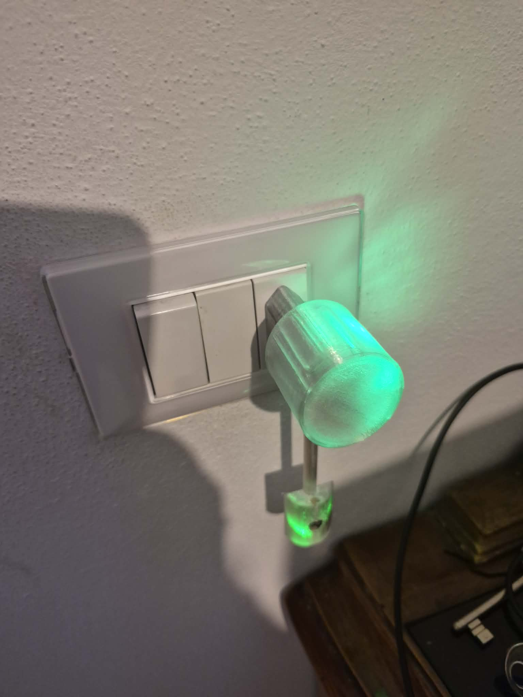
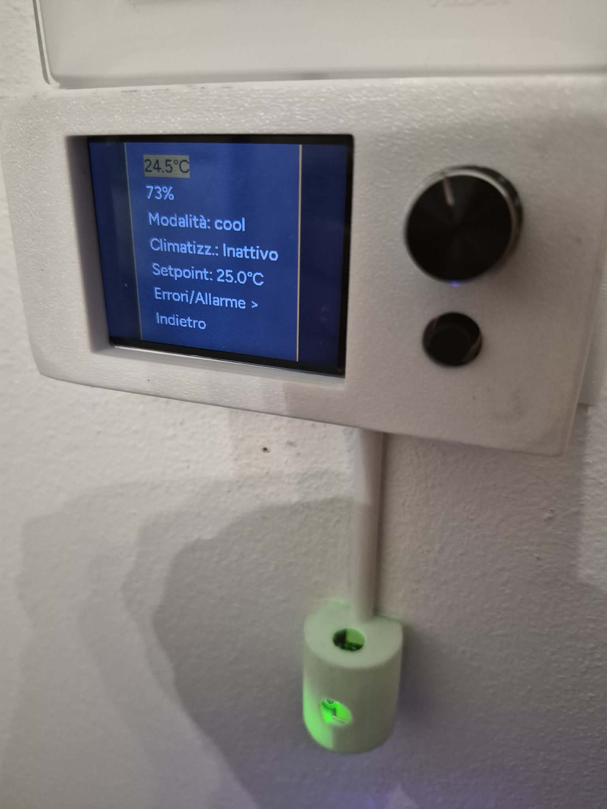
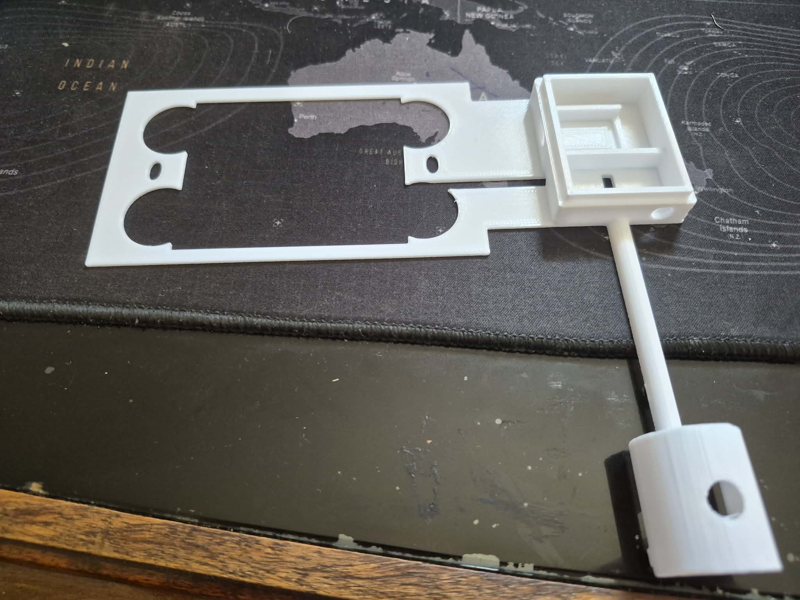
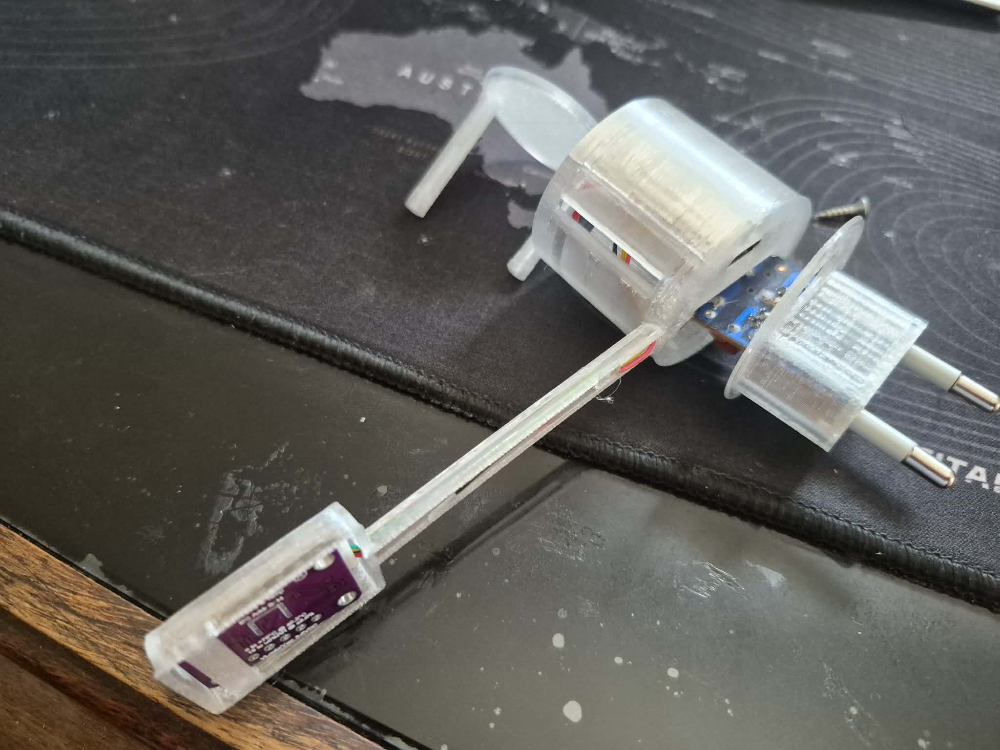
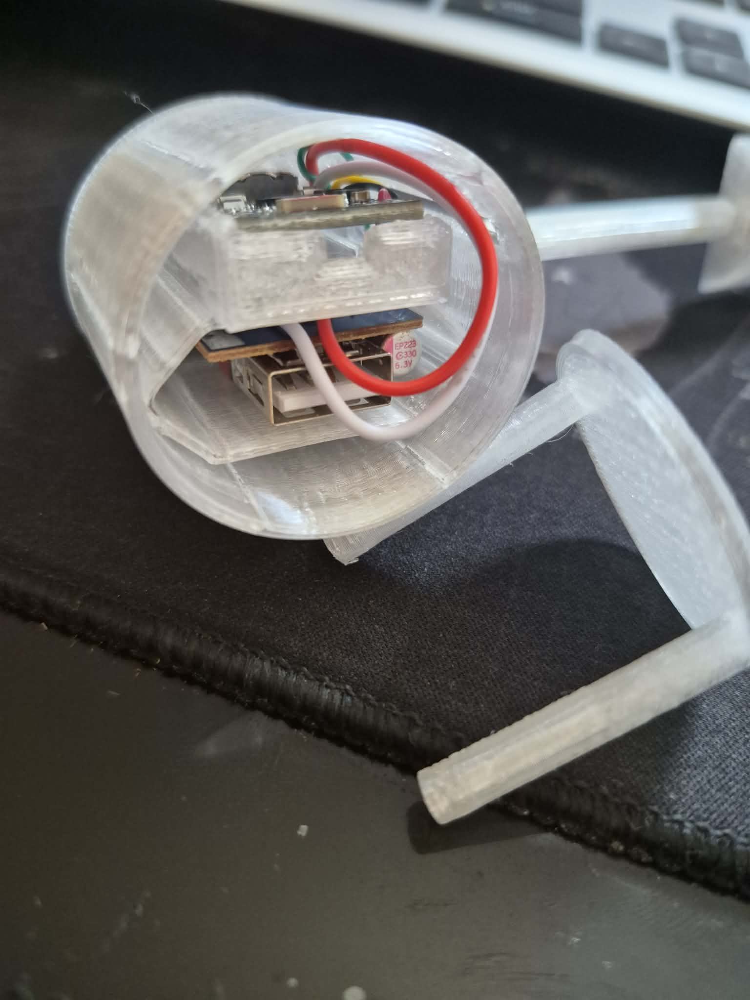
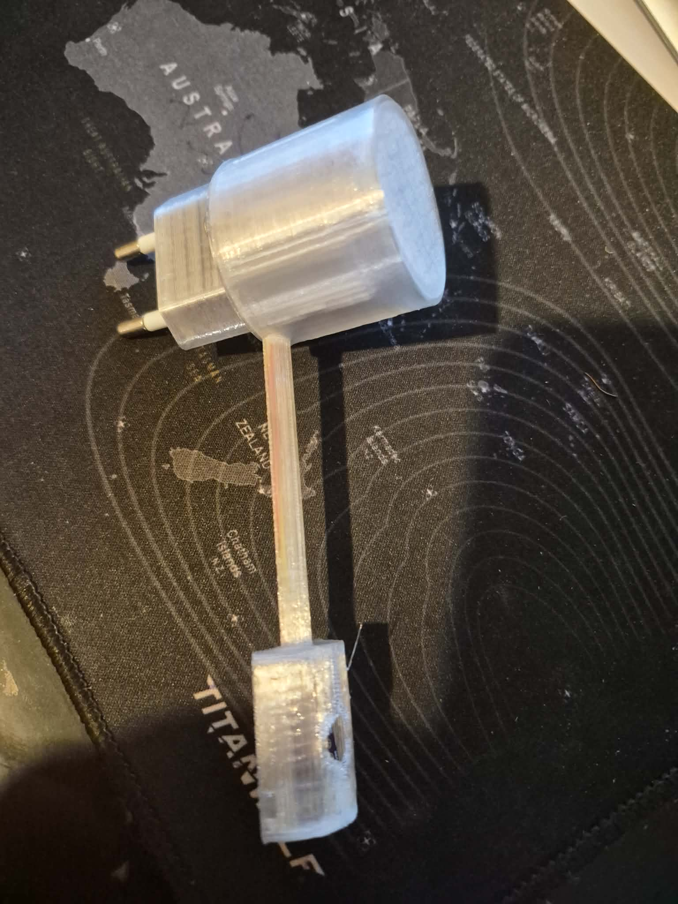

# CLIMAORO

**Sistema di termoregolazione a zone open source**

CLIMAORO è un sistema completo per il controllo centralizzato del riscaldamento e raffrescamento in edifici con impianto a pavimento e pompa di calore, ma adattabile a tutte le tipologie. Progettato per essere replicabile, modulare e professionale.

---

## 🌐 Sito web

[https://UVAVIVA.github.io/CLIMAORO/](https://UVAVIVA.github.io/CLIMAORO/)

**🇬🇧 English version:** [https://UVAVIVA.github.io/CLIMAOROen/](https://UVAVIVA.github.io/CLIMAOROen/)

---

## 📖 Cos'è CLIMAORO

CLIMAORO è un sistema che:

- **Ottimizza la pompa di calore** riducendo i cicli brevi di accensione
- **Gestisce più zone** in modo centralizzato con logica a pesi e soglie
- **Comunica senza WiFi** grazie a ESP-NOW (fallback)
- **Si affianca all'impianto tradizionale** senza sostituirlo
- **Costa meno di 15€ a termostato** (contro i 100-250€ dei sistemi commerciali)

---

## 📷 Termostati

  

---

## 🔧 Stato del progetto

| Funzionalità | Stato |
|--------------|-------|
| Raffrescamento estivo | ✅ In produzione |
| Deumidificatori | ✅ Integrati |
| Fotovoltaico | ✅ Integrato |
| Logica invernale | 🔄 Pronta, in attesa di test |
| Documentazione | 📝 In costruzione |

---

## 🎛️ Termostato encoder integrato con 503

 

---

## 🧩 Componenti principali

| Componente | Descrizione |
|------------|-------------|
| **Termostati** | Dispositivi ESP32 (S3/C6/C3) con sensori, LED, e diverse modalità di installazione (presa elettrica, scatola 503) |
| **Collettore** | Unità centrale con relè per valvole e circolatore, con feedback optoisolato |
| **Logica centralizzata** | Controllo intelligente che decide quando accendere la pompa in base alla domanda aggregata |

---

## 🔌 Termostato mobile

  

---

## 🤝 CERCO COLLABORAZIONI

Questo progetto è aperto a contributi. Cerco persone con competenze specifiche per portare avanti lo sviluppo e migliorare il sistema.

### Aree di interesse

| Area | Competenze cercate |
|------|-------------------|
| **Hardware** | Progettazione PCB, ottimizzazione componenti, miglioramento affidabilità, riduzione costi |
| **Programmazione** | Firmware ESPHome, logica di controllo, integrazione Home Assistant, sviluppo interfacce |
| **Documentazione** | Guide installazione, manuali tecnici, traduzioni |
| **Test** | Test su altri impianti, in contesti diversi, con configurazioni differenti |
| **Sviluppo app** | Applicazione per generare configurazioni senza toccare codice |

### Chi cerco

Persone che sappiano già muoversi in questi ambiti. Il progetto ha raggiunto un livello di complessità che richiede **esperienza consolidata**: chi contribuisce deve saper leggere e modificare codice, comprendere schemi elettrici, o saper documentare in modo chiaro e preciso.

Non è necessario avere esperienza in tutti gli ambiti, ma è importante avere **competenze solide in almeno uno di essi**.

### Come contribuire

1. Esplora il progetto su [GitHub](https://github.com/UVAVIVA/CLIMAORO)
2. Apri una **issue** per discutere le modifiche
3. Fai un **fork** del repository
4. Invia una **pull request**

📌 **Scopri di più:** [https://UVAVIVA.github.io/CLIMAORO/collabora/](https://UVAVIVA.github.io/CLIMAORO/collabora/)

---

## 🛠️ Collettore

  

---

## 📜 Licenza

MIT License – Copyright (c) 2026 UVAVIVA

---

**Costruito con passione, dal nulla.**