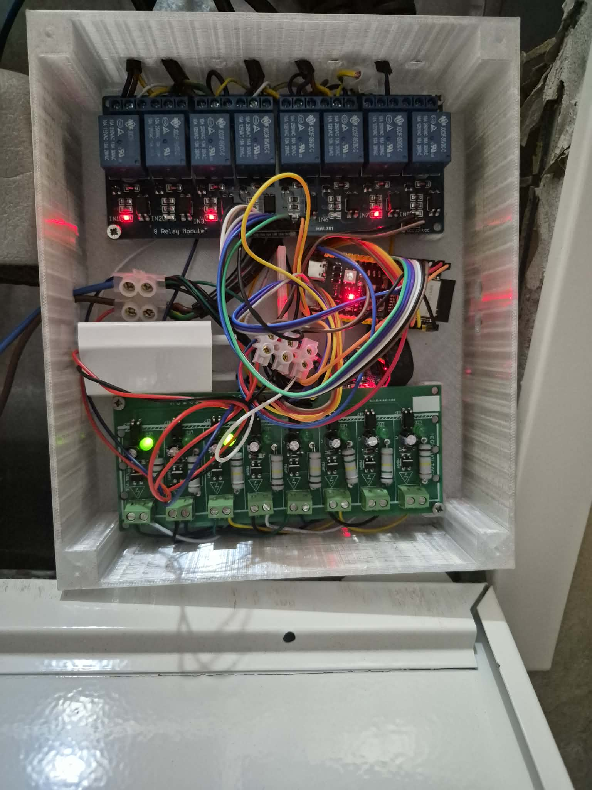
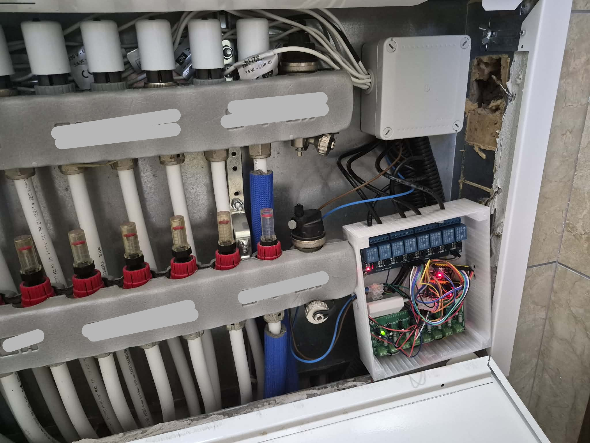
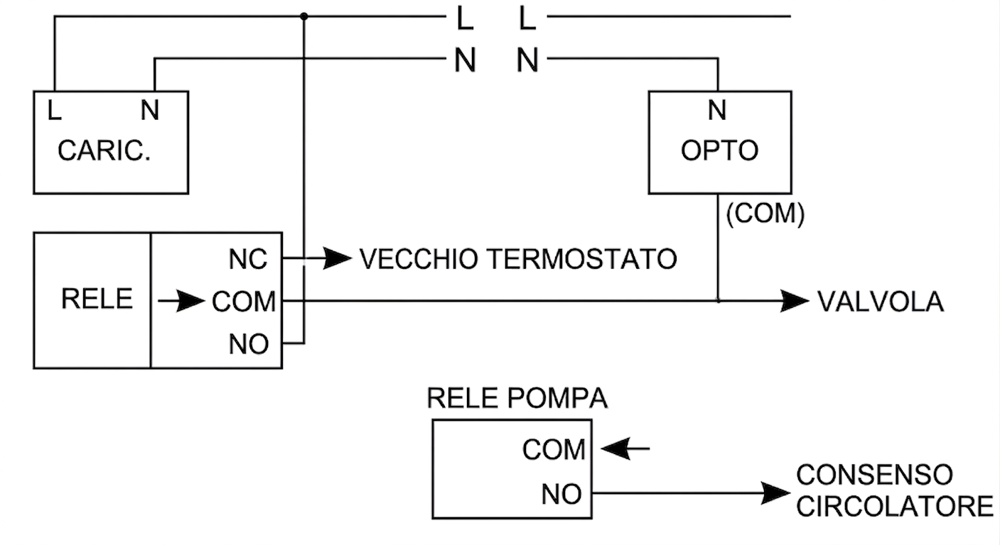
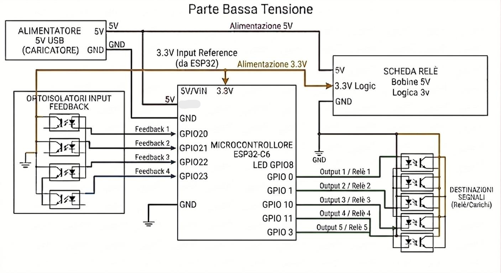

# Il Collettore

> ⚠️ **PERICOLO – TENSIONE DI RETE (230V).** Il collettore lavora collegato alla rete elettrica: il contatto con la tensione può provocare scosse elettriche pericolose. Prima di qualsiasi intervento **stacca la corrente**. Non toccare i componenti interni con il dispositivo alimentato. **Se non hai esperienza con l'elettricità, fai eseguire l'installazione da un elettricista qualificato.**

## Cos'è

Il collettore è il cervello dell'impianto centralizzato. È un ESP32-C6 (funzionano anche S3, C3 o altri modelli ESP32) che riceve i comandi dai termostati via ESP-NOW e aziona le valvole e il circolatore. Ogni collettore serve un gruppo di stanze e zone: alcune stanze hanno una valvola, altre ne hanno più di una.

  

## Componenti necessari

- [Scheda ESP32-C6](https://it.aliexpress.com/item/1005006678253557.html) (o S3/C3): cervello del collettore
- [Modulo relè (4+ canali)](https://it.aliexpress.com/item/1005007538301230.html): un relè per ogni valvola + un relè per il circolatore
- [Optoisolatori](https://it.aliexpress.com/item/1005009598584430.html): un optoisolatore per ogni valvola, fornisce il feedback dello stato
- Caricatore/Alimentatore: uno o più, converte 220V in 5V per ESP32 e relè

## Alimentazione

Il sistema funziona su due livelli di tensione:

- 220V → entra nel caricatore, che converte in 5V per alimentare l'ESP32 e le schede relè
- 3.3V → alimenta gli optoisolatori e i segnali dei relè

Lato AC (220V): gli optoisolatori si collegano al neutro.

## Collegamento relè → valvole

Ogni relè ha tre terminali:

- COM (comune): collegato alla valvola e all'optoisolatore
- NC (normalmente chiuso): collegato al vecchio termostato, che può continuare a funzionare come backup
- NO (normalmente aperto): collegato ai 220V (o al voltaggio della valvola, se diverso)

Quando il relè si attiva, il circuito passa da NC a NO: il vecchio termostato si disconnette e la valvola riceve corrente dal nuovo alimentatore. Se il relè torna a riposo, il circuito ripassa su NC e il vecchio termostato riprende il controllo.

## Collegamento optoisolatori → feedback

L'optoisolatore si collega al COM del relè. Quando il relè si attiva e la valvola riceve corrente, l'optoisolatore lo rileva e manda il segnale di conferma all'ESP32. In questo modo il collettore sa che la valvola si è effettivamente aperta.

Se il relè è attivo ma l'optoisolatore non conferma, il collettore segnala un errore (il relè potrebbe essere guasto o la valvola bloccata).

## Relè circolatore

Il circolatore ha un relè dedicato. A differenza delle valvole, qui si usano solo COM e NO: quando il relè si attiva, il circuito si chiude e il circolatore parte. Il collettore gestisce un ritardo prima di avviarlo (aspetta che almeno una valvola sia aperta) e uno spegnimento ritardato (dopo l'ultima valvola che si chiude).

## Logica di sicurezza

- Timeout per zona: ogni valvola ha un limite di tempo massimo di apertura (2 ore). Se un termostato smette di comunicare (es. si disconnette), il collettore spegne la valvola dopo il timeout per evitare che rimanga accesa senza controllo. Se il termostato torna online e chiede di riaccendere, il collettore lo fa subito.
- Controllo coerenza: ogni 2 minuti il collettore verifica che lo stato dei relè coincida con il feedback degli optoisolatori. Se c'è una discrepanza, segnala un errore.
- Allarme circolatore: se il circolatore non parte nonostante la richiesta, il collettore invia un allarme a tutti i termostati.

## Materiali e collegamenti

- Filo 1.5mm² per alimentazione 220V (L e N)
- Filo AWG24 o AWG20 per COM, NO e NC dei relè
- Morsettiere per giunzioni fisse
- Cappucci (crimp) per connessioni rapide
- Connettori a scatto per collegamenti senza saldatura

## Parte 220V

### Alimentazione di rete

La rete domestica 220V entra nel caricatore tramite le linee L (fase) e N (neutro). Il caricatore converte i 220V in 5V per alimentare l'ESP32 e le schede relè.

### Relè delle valvole

Ogni valvola è controllata da un relè a tre terminali:

- **NO** → collegato alla fase (L) a 220V
- **COM** → collegato alla valvola e all'optoisolatore
- **NC** → collegato al vecchio termostato (fallback manuale)

Quando il relè si attiva, il circuito passa da NC a NO: la valvola riceve corrente e si apre. Quando torna a riposo, il vecchio termostato riprende il controllo.

> **Nota:** Questa guida descrive un impianto a 220V in corrente alternata. Per impianti con voltaggio diverso o in corrente continua, è necessario modificare i collegamenti in base alle specifiche delle valvole e dell'alimentazione utilizzata.

### Relè del circolatore

Il circolatore ha un relè dedicato con solo COM e NO:

- **COM** → ingresso dal circolatore
- **NO** → uscita consenso circolatore

Quando il relè si attiva, il circolatore parte. Il collettore gestisce un ritardo di avvio e spegnimento ritardato.

### Optoisolatori

Ogni optoisolatore monitora lo stato del relè corrispondente:

- **N** → neutro (condiviso con il caricatore)
- **COM** → collegato al COM del relè

Quando il relè si attiva, l'opto lo rileva e manda il feedback all'ESP32.

### Schema elettrico 220V

## Parte Bassa Tensione

### Alimentazione 5V

Il caricatore fornisce 5V che alimentano:

- **ESP32-C6** → attraverso il pin VIN o 5V della scheda
- **Scheda relè** → i relè ricevono 5V per le bobine

Il GND del caricatore va collegato al GND dell'ESP32 e della scheda relè.

### Alimentazione 3.3V

L'ESP32 fornisce 3.3V dal pin dedicato. Questa tensione alimenta:

- **Optoisolatori** → ogni opto riceve 3.3V per il lato digitale
- **Segnali dei relè** → i pin dei relè operano a 3.3V

Il GND è comune a tutto il sistema.

### Connessioni ESP32 → Relè

Ogni relè è controllato da un pin GPIO dell'ESP32. Quando il GPIO va alto (3.3V), il relè si attiva.

| Zona | Pin Relè |
|------|----------|
| 1 | GPIO0 |
| 2 | GPIO1 |
| 3 | GPIO10 |
| 4 | GPIO11 |
| Circolatore | GPIO3 |
| LED | GPIO8 |

### Connessioni Optoisolatori → ESP32

Ogni optoisolatore fornisce il feedback dello stato del relè corrispondente. Quando il relè si attiva e l'opto rileva la corrente, manda un segnale al GPIO dell'ESP32.

| Zona | Pin Feedback |
|------|--------------|
| 1 | GPIO20 |
| 2 | GPIO21 |
| 3 | GPIO22 |
| 4 | GPIO23 |

### Connessioni optoisolatori → relè (lato AC)

Il lato AC dell'optoisolatore si collega al COM del relè corrispondente. Questo permette all'opto di rilevare quando il relè è attivo e la valvola riceve corrente.

### Schema bassa tensione

---

## Note

- **⚠️ Sicurezza:** il collettore contiene tensione di rete (230V). **Lavora sempre a corrente staccata**, usa materiali isolati e verifica i collegamenti prima di riattaccare la corrente. Non esporre il dispositivo a umidità o contatti accidentali.
- **Responsabilità:** questo tutorial ha **scopo informativo e didattico**. Non è un prodotto industriale, ma un dispositivo **artigianale**, costruito e usato **senza alcuna garanzia**. Chi esegue il montaggio lo fa a **proprio rischio e si assume la responsabilità** per danni a persone o cose derivanti dall'uso del dispositivo.
- **Riferimento:** questo tutorial è parte della documentazione ufficiale [CLIMAORO su GitHub](https://github.com/UVAVIVA/CLIMAORO).

**📋 Tutorial montaggio:**

- [Guida completa al montaggio del termostato](montaggio.md)
- [Sito web - pagina Montaggio](https://UVAVIVA.github.io/CLIMAORO/montaggio/)

**Configurazione per la compilazione:**

- [Config principale collettore - esempio pronto da copiare (italiano)](https://github.com/UVAVIVA/climaoro-components/blob/main/CLIMAORO_Collettore-Esempio.yaml)
